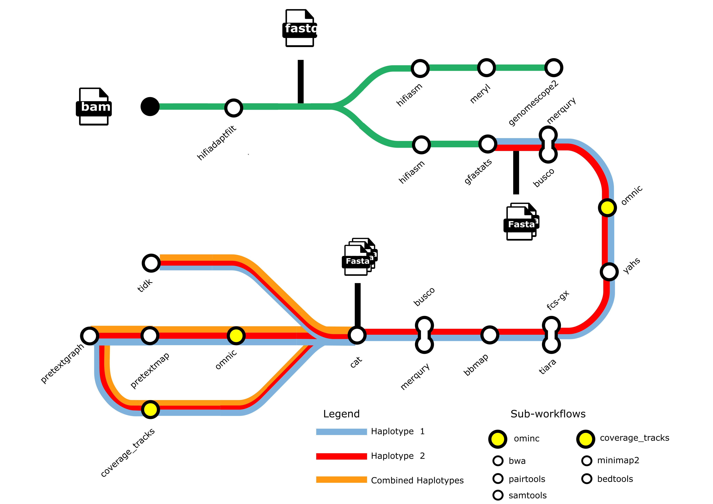

[](https://www.nextflow.io/)
[](https://docs.conda.io/en/latest/)
[](https://www.docker.com/)
[](https://sylabs.io/docs/)
[](https://tower.nf/launch?pipeline=https://github.com/Computational-Biology-OceanOmics/OceanGenomes-refgenomes)

## Introduction

This pipeline is designed for the de novo genome assembly and analysis of high-quality marine vertebrate genomes as part of the **Minderoo OceanOmics Ocean Genomes Project**. It processes raw HiFi and Hi-C data, performs assembly, scaffolding, decontamination, generates key assembly statistics and prepares the genome for manual curation within pretext map.

<p align="center">
    
</p>

The pipeline supports four assembly modes selected via `--assembly_mode`:

| Mode | Flag | Description |
|------|------|-------------|
| HiFi + Hi-C (default) | `--assembly_mode hifi_hic` | Full dual-haplotype assembly from raw reads |
| HiFi only | `--assembly_mode hifi_only` | Assembly from HiFi reads alone (no Hi-C scaffolding) |
| Precomputed dual-hap | samplesheet `hap1_assembly` + `hap2_assembly` | Skip Hifiasm, run full dual-hap pipeline on existing assemblies |
| Precomputed single-hap | samplesheet `primary_assembly` | Skip Hifiasm, run single-haplotype pipeline on existing assembly |

---

### `hifi_hic` — Standard dual-haplotype mode (default)

1. Filter and convert bam files to fastq files ([`HiFiAdapterFilt`](https://github.com/sheinasim/HiFiAdapterFilt))
2. PacBio Read QC ([`FastQC`](https://www.bioinformatics.babraham.ac.uk/projects/fastqc/))
3. Count k-mers ([`Meryl`](https://github.com/marbl/meryl))
4. Estimate genome size ([`GenomeScope2`](https://github.com/schatzlab/genomescope))
5. Illumina Hi-C Read QC ([`FastQC`](https://www.bioinformatics.babraham.ac.uk/projects/fastqc/))
6. Trim Hi-C reads ([`Fastp`](https://github.com/OpenGene/fastp))
7. Assemble HiFi + Hi-C reads into hap1 and hap2 ([`Hifiasm`](https://github.com/chhylp123/hifiasm))
8. Assembly stats ([`Gfastats`](https://github.com/vgl-hub/gfastats))
9. Gene assembly QC ([`BUSCO`](https://busco.ezlab.org/))
10. K-mer assembly QC ([`Merqury`](https://github.com/marbl/merqury))
11. Align Hi-C reads to each haplotype ([`BWA`](https://github.com/lh3/bwa) / [`Pairtools`](https://pairtools.readthedocs.io/en/latest/))
12. Scaffold ([`YAHS`](https://github.com/c-zhou/yahs))
13. NCBI decontamination screen ([`fcs-gx`](https://github.com/ncbi/fcs-gx))
14. Organelle / bacteria / archaea classification ([`Tiara`](https://github.com/ibe-uw/tiara))
15. Filter contaminant scaffolds ([`BBMap`](https://jgi.doe.gov/data-and-tools/software-tools/bbtools/bb-tools-user-guide/bbmap-guide/))
16. Final scaffold stats ([`Gfastats`](https://github.com/vgl-hub/gfastats))
17. Final gene QC ([`BUSCO`](https://busco.ezlab.org/))
18. Final k-mer QC ([`Merqury`](https://github.com/marbl/merqury))
19. Rename scaffolds with sequential SCAFFOLD_N numbering ([`CAT_SCAFFOLDS`](modules/local/cat_scaffolds/main.nf))
20. Generate coverage tracks ([`minimap2`](https://github.com/lh3/minimap2) / [`bedtools`](https://github.com/arq5x/bedtools2))
21. Predict telomere locations ([`tidk`](https://github.com/tolkit/telomeric-identifier))
22. Find telomere windows ([`FindTelomereWindows`](https://github.com/sanger-tol/treeval))
23. Align Hi-C reads to scaffolds ([`BWA`](https://github.com/lh3/bwa) / [`Pairtools`](https://pairtools.readthedocs.io/en/latest/))
24. Generate pretext maps ([`PretextMap`](https://github.com/sanger-tol/PretextMap)) with coverage and telomere tracks ([`PretextGraph`](https://github.com/sanger-tol/PretextGraph))
25. Present QC for raw reads ([`MultiQC`](http://multiqc.info/))

---

### `hifi_only` — HiFi-only assembly mode

Use this mode when Hi-C data is not available. Hifiasm assembles primary and alternate contigs from HiFi reads alone. There is no scaffolding step.

1. Filter and convert bam files to fastq files ([`HiFiAdapterFilt`](https://github.com/sheinasim/HiFiAdapterFilt))
2. PacBio Read QC ([`FastQC`](https://www.bioinformatics.babraham.ac.uk/projects/fastqc/))
3. Count k-mers ([`Meryl`](https://github.com/marbl/meryl))
4. Estimate genome size ([`GenomeScope2`](https://github.com/schatzlab/genomescope))
5. Assemble HiFi reads into primary + alternate contigs ([`Hifiasm`](https://github.com/chhylp123/hifiasm))
6. Assembly stats on primary and alternate contigs ([`Gfastats`](https://github.com/vgl-hub/gfastats))
7. Gene assembly QC ([`BUSCO`](https://busco.ezlab.org/))
8. K-mer assembly QC ([`Merqury`](https://github.com/marbl/merqury))
9. Present QC for raw reads ([`MultiQC`](http://multiqc.info/))

### Precomputed dual-haplotype mode

When both `hap1_assembly` and `hap2_assembly` columns are provided, the pipeline skips Hifiasm and runs the full dual-haplotype pipeline from those assemblies — GFASTATS → BUSCO → MERQURY → OMNIC → YAHS → DECONTAMINATION → GFASTATS2 → BUSCO → CAT_SCAFFOLDS → COVERAGE → TELO → PRETEXT.

`samplesheet.csv`:

```csv
sample,hifi_dir,hic_dir,version,date,tolid,taxid,species,primary_assembly,hap1_assembly,hap2_assembly
OG750,/path/to/OG750/hifi,/path/to/OG750/hic,hic2,v250401,fXxxYyy1,12345,Species name,,/path/to/OG750/hap1,/path/to/OG750/hap2
```

Each column can point to either a **directory** (the pipeline auto-detects the `.fa`/`.fasta`/`.gfa` file inside) or a **direct file path**. HiFi and Hi-C reads are still required for Meryl/Merqury/YAHS.

> [!NOTE]
> `hap1_assembly` and `hap2_assembly` must be provided together — providing only one will cause an error. Leave `primary_assembly` empty when using dual mode.

### Precomputed assembly mode (single-haplotype)

When a pre-generated assembly FASTA is provided via the `primary_assembly` samplesheet column, the pipeline skips Hifiasm and instead routes the sample through a dedicated single-haplotype subworkflow (`SINGLE_HAPLOTYPE`). Only one haplotype is processed end-to-end.

Steps run in this mode:

1. Load and validate precomputed assembly ([`PREPARE_PRECOMPUTED_ASSEMBLY`](modules/local/prepare_precomputed_assembly/main.nf))
2. Assembly stats ([`Gfastats`](https://github.com/vgl-hub/gfastats))
3. Gene assembly QC ([`BUSCO`](https://busco.ezlab.org/))
4. K-mer assembly QC ([`Merqury`](https://github.com/marbl/merqury))
5. Index assemble and align Hi-C reads ([`BWA`](https://github.com/lh3/bwa) / [`Pairtools`](https://pairtools.readthedocs.io/en/latest/))
6. Scaffold ([`YAHS`](https://github.com/c-zhou/yahs))
7. Decontaminate — NCBI screen ([`fcs-gx`](https://github.com/ncbi/fcs-gx)), organelle/bacteria/archaea filter ([`Tiara`](https://github.com/ibe-uw/tiara)), filter ([`BBMap`](https://jgi.doe.gov/data-and-tools/software-tools/bbtools/bb-tools-user-guide/bbmap-guide/))
8. Final scaffold stats ([`Gfastats`](https://github.com/vgl-hub/gfastats))
9. Final gene QC ([`BUSCO`](https://busco.ezlab.org/))
10. Rename scaffolds ([`RENAME_SCAFFOLDS`](modules/local/rename_scaffolds/main.nf))
11. Generate coverage tracks ([`minimap2`](https://github.com/lh3/minimap2) / [`bedtools`](https://github.com/arq5x/bedtools2))
12. Predict telomere locations ([`tidk`](https://github.com/tolkit/telomeric-identifier)) / find telomere windows ([`FindTelomereWindows`](https://github.com/sanger-tol/treeval))
13. Generate pretext maps ([`PretextMap`](https://github.com/sanger-tol/PretextMap)) with coverage and telomere tracks ([`PretextGraph`](https://github.com/sanger-tol/PretextGraph))

## Usage

> [!NOTE]
> If you are new to Nextflow, please refer to [this page](https://nf-co.re/docs/usage/installation) on how to set-up Nextflow.

### `hifi_hic` — Standard dual-haplotype mode

`samplesheet.csv`:

```csv
sample,hifi_dir,hic_dir,version,date,tolid,taxid,species,primary_assembly,hap1_assembly,hap2_assembly
OG88,hifi_bams/OG88,hic_fastqs/OG88,hic1,v240101,fOphLin1,163129,Ophthalmolepis lineolata,,,
OG90,hifi_fastqs/OG90,hic_fastqs/OG90,hic1,v240303,fOphLin2,163129,Ophthalmolepis lineolata,,,
```

```bash
nextflow run Computational-Biology-OceanOmics/OceanGenomes-refgenomes \
   -profile singularity \
   --input samplesheet.csv \
   --outdir <OUTDIR> \
   --assembly_mode hifi_hic \
   --buscodb /path/to/busco_db/actinopterygii_odb10 \
   --gxdb /path/to/gxdb \
   --binddir /scratch \
   --scaffolder yahs \
   --tempdir /path/to/tmp \
   -c pawsey_profile.config \
   -resume
```

### `hifi_only` — HiFi-only assembly mode

Use when Hi-C data is not available. Leave `hic_dir` empty in the samplesheet.

`samplesheet.csv`:

```csv
sample,hifi_dir,hic_dir,version,date,tolid,taxid,species,primary_assembly,hap1_assembly,hap2_assembly
OG88,hifi_bams/OG88,,hifi1,v240101,fOphLin1,163129,Ophthalmolepis lineolata,,,
```

```bash
nextflow run Computational-Biology-OceanOmics/OceanGenomes-refgenomes \
   -profile singularity \
   --input samplesheet.csv \
   --outdir <OUTDIR> \
   --assembly_mode hifi_only \
   --buscodb /path/to/busco_db/actinopterygii_odb10 \
   --gxdb /path/to/gxdb \
   --binddir /scratch \
   --tempdir /path/to/tmp \
   -c pawsey_profile.config \
   -resume
```

> [!NOTE]
> `--scaffolder` is not required in `hifi_only` mode — there is no Hi-C scaffolding step.

### Precomputed assembly mode

If you already have a genome assembly FASTA and want to run only QC, scaffolding, decontamination and visualisation (bypassing Hifiasm), provide the path to the assembly directory in the `primary_assembly` column of the samplesheet.

The directory must contain exactly one FASTA file (`.fasta` or `.fa`, optionally gzipped).

`samplesheet.csv`:

```csv
sample,hifi_dir,hic_dir,version,date,tolid,taxid,species,primary_assembly
OG39,/path/to/OG39/hifi,/path/to/OG39/hic,hic2,v250331,fMeuGal1,303721,Meuschenia galii,/path/to/OG39/assembly
```

> [!NOTE]
> HiFi reads are still required for k-mer QC (Meryl/GenomeScope2/Merqury). Hi-C reads are required for scaffolding (YAHS).

The pipeline will automatically detect the `primary_assembly` path and route the sample through the single-haplotype subworkflow. No additional flags are needed.

```bash
nextflow run Computational-Biology-OceanOmics/OceanGenomes-refgenomes \
   -profile singularity \
   --input samplesheet.csv \
   --outdir <OUTDIR> \
   --buscodb /path/to/busco_db/actinopterygii_odb10 \
   --gxdb /path/to/gxdb \
   --binddir /scratch \
   --scaffolder yahs \
   --tempdir /path/to/tmp \
   -c pawsey_profile.config \
   -resume
```

> [!WARNING]
> Please provide pipeline parameters via the CLI or Nextflow `-params-file` option. Custom config files including those provided by the `-c` Nextflow option can be used to provide any configuration _**except for parameters**_;
> see [docs](https://nf-co.re/usage/configuration#custom-configuration-files).

For more details and further functionality, please refer to the [usage documentation](https://github.com/Computational-Biology-OceanOmics/OceanOmics-OceanGenomes-ref-genomes/blob/master/docs/usage.md) and the [parameter documentation](https://github.com/Computational-Biology-OceanOmics/OceanOmics-OceanGenomes-ref-genomes/blob/master/docs/parameters.md).

## Pipeline output

For details about the output files and reports, please refer to the
[output documentation](https://github.com/Computational-Biology-OceanOmics/OceanOmics-OceanGenomes-ref-genomes/blob/master/docs/output.md).

## Credits

Computational-Biology-OceanOmics/OceanOmics-OceanGenomes-ref-genomes was originally adapted from the Vertebrate Genome project Galaxy pipeline (https://galaxyproject.org/projects/vgp/) by Emma de Jong and was converted to Nextflow by Lauren Huet and Adam Bennett. This version was built on top of the nf-core template.

## Citations

<!-- TODO nf-core: Add citation for pipeline after first release. Uncomment lines below and update Zenodo doi and badge at the top of this file. -->
<!-- If you use OceanGenomes-refgenomes for your analysis, please cite it using the following doi: [10.5281/zenodo.XXXXXX](https://doi.org/10.5281/zenodo.XXXXXX) -->

An extensive list of references for the tools used by the pipeline can be found in the [`CITATIONS.md`](CITATIONS.md) file.

You can cite the `nf-core` publication as follows:

> **The nf-core framework for community-curated bioinformatics pipelines.**
>
> Philip Ewels, Alexander Peltzer, Sven Fillinger, Harshil Patel, Johannes Alneberg, Andreas Wilm, Maxime Ulysse Garcia, Paolo Di Tommaso & Sven Nahnsen.
>
> _Nat Biotechnol._ 2020 Feb 13. doi: [10.1038/s41587-020-0439-x](https://dx.doi.org/10.1038/s41587-020-0439-x).
